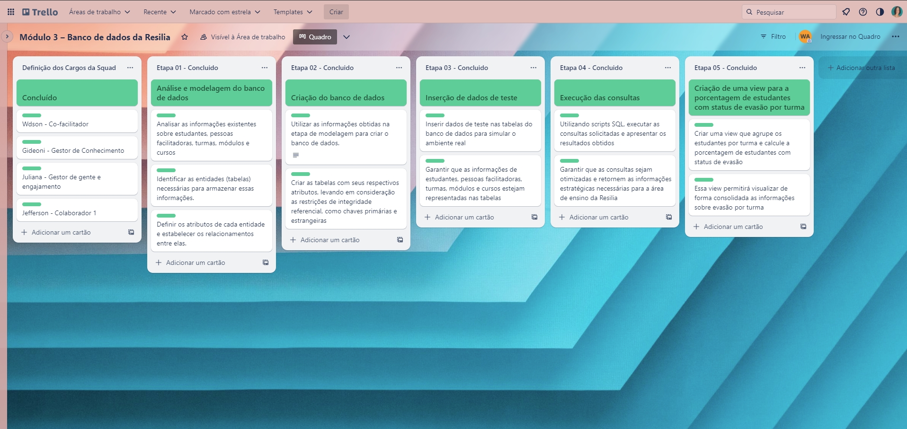

# RESILIDATA

Este é o repositório do projeto RESILIDATA, um sistema de gerenciamento de estudantes, turmas, cursos, módulos e facilitadores. O projeto utiliza um banco de dados PostgreSQL e foi desenvolvido como parte das atividades do curso Resilia Educação.

## Descrição

O Resilia Data é um sistema de gerenciamento de dados para uma instituição de ensino, permitindo o controle de estudantes, turmas, cursos, módulos e facilitadores. O sistema utiliza o banco de dados PostgreSQL para armazenar as informações de forma estruturada e segura.

## Funcionalidades

- Cadastro de estudantes, turmas, cursos, módulos e facilitadores.
- Associação de estudantes a turmas, cursos, módulos e facilitadores.
- Registro de informações como nome, data de nascimento, e-mail, endereço, telefone, CPF, status, descrição, carga horária, data de início e data de término.
- Controle de status dos estudantes (ativo ou inativo) com registro de alterações.
- Relatórios e consultas para análise e acompanhamento dos dados.

## Tecnologias utilizadas

- PostgreSQL: banco de dados relacional utilizado para armazenar as informações do sistema.
- SQL: linguagem de consulta utilizada para interagir com o banco de dados.
- PL/pgSQL: linguagem procedural do PostgreSQL utilizada para criar funções e triggers.
- Git: sistema de controle de versão utilizado para o gerenciamento do código-fonte.
- GitHub: plataforma de hospedagem de repositórios Git utilizada para compartilhar o projeto.
- Lucidchart: ferramenta de modelagem de dados utilizada para criar o diagrama do banco de dados.
- Discord: aplicativo de comunicação em grupo utilizado para os encontros do grupo de desenvolvimento.
- WhatsApp: aplicativo de comunicação utilizado para as interações do grupo de desenvolvimento.

## Estrutura do Banco de Dados

O banco de dados do projeto possui as seguintes tabelas:

- `ESTUDANTE`: tabela para armazenar os dados dos estudantes.
- `TURMA`: tabela para armazenar os dados das turmas.
- `CURSO`: tabela para armazenar os dados dos cursos.
- `MODULO`: tabela para armazenar os dados dos módulos.
- `FACILITADOR`: tabela para armazenar os dados dos facilitadores.
- `LOG_ESTUDANTE`: tabela para registrar o histórico de alterações no status dos estudantes.
- `RESILIA`: tabela para associar os estudantes, turmas, cursos, módulos e facilitadores.

Para obter mais detalhes sobre a estrutura do banco de dados, consulte o arquivo [CREATE.sql](CREATE.sql).

## Perguntas Extras

A partir do banco de dados, é possível extrair resultados importantes para análise. Algumas perguntas extras que podem ser respondidas são:

- **Quais são os facilitadores que estão em mais de uma turma?**
- **Quais são os cursos mais populares com base no número de alunos matriculados?**
- **Quais são os alunos que estão matriculados em mais de uma turma?**
  

## Instalação e Configuração

1. Certifique-se de ter o PostgreSQL instalado e configurado em seu ambiente.
2. Clone o repositório do projeto em sua máquina local.
3. Importe o arquivo `database.sql` para criar o banco de dados e as tabelas necessárias.
4. Configure as credenciais de acesso ao banco de dados no arquivo de configuração.

## Contribuição

Contribuições são bem-vindas! Sinta-se à vontade para abrir uma nova issue para relatar problemas, sugerir melhorias ou enviar pull requests com novas funcionalidades.

## Contato

Para mais informações ou dúvidas sobre o projeto, entre em contato:

- )

- )

## Licença

Este projeto está licenciado sob a licença [MIT](LICENSE).
